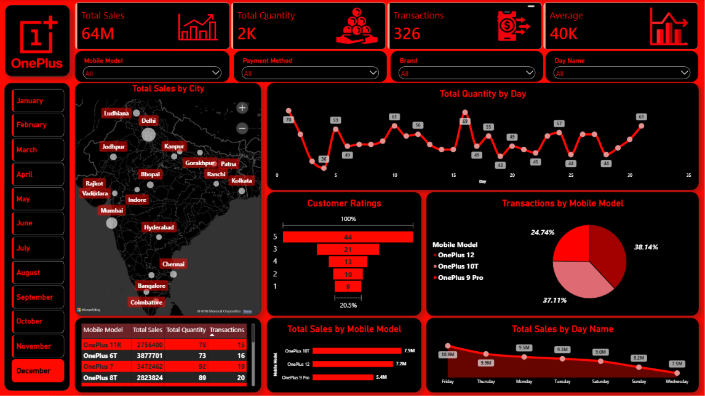

# 📊 OnePlus Sales Dashboard

## 📌 Project Overview

This project is an interactive **OnePlus Sales Dashboard** developed using **Microsoft Power BI**.

The dashboard provides a clear overview of sales performance, quantity, transactions, customer ratings, mobile models, city-wise sales, and time-based trends.

## 🎯 Key Performance Indicators

* **Total Sales:** 769M
* **Total Quantity:** 19K
* **Transactions:** 4K
* **Average:** 40K

## 📊 Dashboard Features

### 🔹 Interactive Filters

* Mobile Model
* Payment Method
* Brand
* Day Name
* Month-wise filtering

### 🔹 Visualizations

* Total Sales by City using Map
* Total Quantity by Month
* Customer Ratings
* Transactions by Mobile Model
* Mobile Model sales details
* Total Sales by Mobile Model
* Total Sales by Day Name

## 🛠️ Tools & Technologies

* Microsoft Power BI
* Power Query
* DAX
* Data Cleaning & Transformation
* Data Analysis
* Data Visualization

## 💡 Key Analysis Areas

The dashboard helps analyze:

* Overall sales and transaction performance
* Monthly quantity trends
* Sales performance across mobile models
* Transaction distribution by mobile model
* Customer rating distribution
* City-wise sales performance
* Day-wise sales trends

## 🎯 Project Objective

The objective of this project is to practice **data analysis, interactive dashboard development, data visualization, and business-focused reporting using Microsoft Power BI**.

## 📷 Dashboard Preview

## 📁 Project Files

* `OnePlus Sales Dashboard.pbix` — Power BI dashboard file
* `Oneplus_Sales_Dashboard.png` — Dashboard preview
* `README.md` — Project documentation

## 🚀 Skills Demonstrated

* Data Transformation
* Data Modeling
* DAX Calculations
* Interactive Filtering
* Dashboard Design
* Business Data Visualization
* Power BI Reporting

---

### 👨‍💻 Created By

**Harshit Maharaj**

BBA Business Analytics Student | Aspiring Data Analyst | BI Enthusiast
